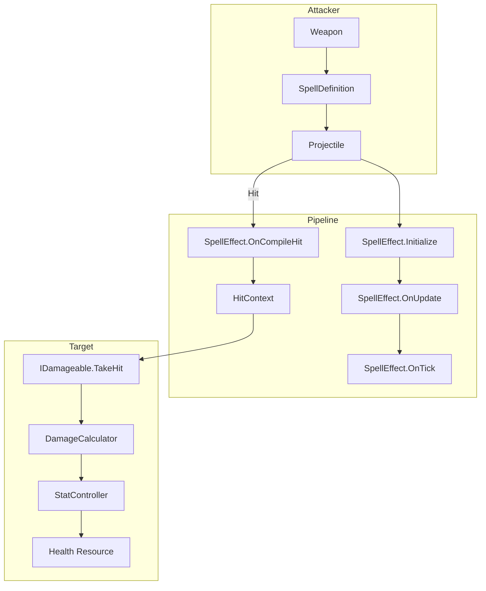
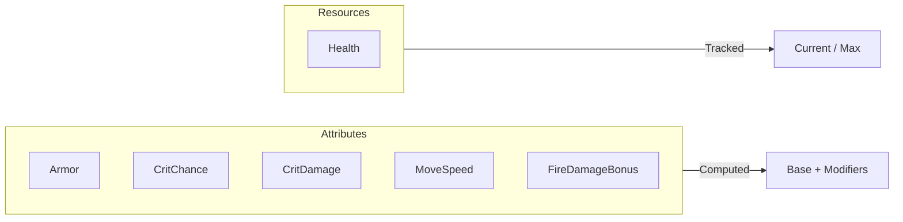
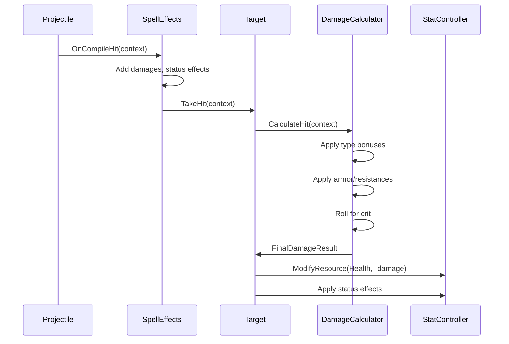
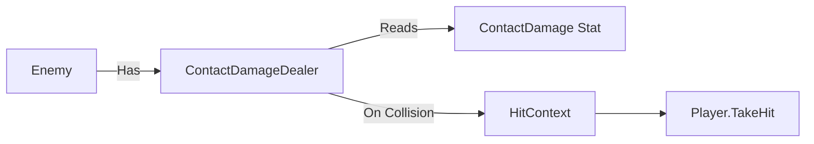

# Damage System Documentation

A flexible, extensible damage system for Unity that supports both player and enemy damage, stats, modifiers, status effects, and a modular spell effect pipeline.

---

## Table of Contents

1. [Architecture Overview](#architecture-overview)
2. [Core Concepts](#core-concepts)
3. [Stats System](#stats-system)
4. [Damage Flow](#damage-flow)
5. [SpellEffect Pipeline](#spelleffect-pipeline)
6. [Enemy Systems](#enemy-systems)
7. [API Reference](#api-reference)

---

## Architecture Overview



---

## Core Concepts

### Files Overview

| File | Purpose |
|------|---------|
| `DamageSystemBase.cs` | Enums, data classes, interfaces, DamageCalculator |
| `StatController.cs` | Entity stat management (attributes + resources) |
| `SpellEffect.cs` | Base class for spell effect pipeline |
| `SpellDefinition.cs` | Combines projectile + effects into a "recipe" |
| `StatusEffect.cs` | Timed stat modifier packages |
| `Projectile.cs` | Player projectile with effect pipeline |
| `EnemyProjectile.cs` | Enemy projectile with full effect support |
| `ContactDamageDealer.cs` | Touch damage for melee enemies |
| `EnemyAttackController.cs` | Enemy targeting and ranged attacks |

---

## Stats System

### Stat Types

Stats are divided into two categories:



### Modifier Calculation

Modifiers are applied in order: **Flat → PercentAdd → PercentMultiply**

```
Example: Base 100
+ Flat 10            → 110
+ PercentAdd 20%     → 110 * 1.2 = 132
+ PercentMultiply 50% → 132 * 1.5 = 198
```

### Resource Stats

Resource stats (like Health) track both current and max values:

```csharp
// Configure in ResourceStatConfig.ResourceTypes
public static readonly HashSet<StatType> ResourceTypes = new HashSet<StatType>
{
    StatType.Health,
    // StatType.Mana,
};

// Usage
stats.ModifyResource(StatType.Health, -25);  // Damage
stats.ModifyResource(StatType.Health, +10);  // Heal
stats.GetResourceRatio(StatType.Health);     // For health bars
```

### Events

```csharp
// Subscribe to all resource changes
stats.OnAnyResourceChanged += (sender, args) => {
    Debug.Log($"{args.StatType}: {args.NewValue}/{args.MaxValue}");
};

// Subscribe to specific resource
stats.SubscribeToResource(StatType.Health, OnHealthChanged);
```

---

## Damage Flow



### HitContext

The "packet" that flows through the damage pipeline:

```csharp
public class HitContext
{
    public IDamageable Target;
    public StatController AttackerStats;
    public List<DamageInstance> Damages;       // Accumulated by SpellEffects
    public List<StatusEffectApplication> StatusEffects;
}
```

---

## SpellEffect Pipeline

SpellEffects are ScriptableObjects that hook into projectile lifecycle:

| Callback | When | Use For |
|----------|------|---------|
| `Initialize` | On spawn | Set speed, lifetime, size |
| `OnUpdate` | Every frame | Homing, wobble |
| `OnTick` | Fixed interval | Area effects |
| `OnCompileHit` | Before TakeHit | Add/modify damage |
| `OnHit` | After TakeHit | Explosions, chains |
| `OnLifetimeEnd` | Expire | End-of-life effects |

### Creating a SpellEffect

```csharp
[CreateAssetMenu(fileName = "Effect_MyEffect", menuName = "Spells/Effects/My Effect")]
public class Effect_MyEffect : SpellEffect
{
    public float damageBonus = 10f;
    
    public override void OnCompileHit(IProjectile projectile, HitContext context)
    {
        foreach (var dmg in context.Damages) {
            dmg.Amount += damageBonus;
        }
    }
}
```

### Built-in Effects

| Effect | Purpose |
|--------|---------|
| `Effect_BaseProjectileStats` | Sets speed, lifetime, size, tick rate |
| `Effect_AddDamage` | Adds a damage instance |
| `Effect_AddDamagePercent` | Percentage bonus to damage type |
| `Effect_ConvertDamage` | Converts one damage type to another |
| `Effect_Homing` | Tracks nearby targets |
| `Effect_HitTwice` | Delayed second hit |

---

## Enemy Systems

### Contact Damage



**Setup:**
1. Add `ContactDamageDealer` to enemy
2. Configure `ContactDamage` stat in `StatController`
3. Optional: Add status effects to apply

### Ranged Attacks


**Setup:**
1. Add `EnemyAttackController` to enemy
2. Create a `SpellDefinition` asset
3. Assign `EnemyProjectile` prefab
4. Add SpellEffects to definition

---

## API Reference

### StatController

```csharp
// Attribute stats (computed value)
float GetStatValue(StatType type);
void AddModifier(StatType type, StatModifier mod);
void RemoveModifiersFromSource(object source);

// Resource stats (current/max tracking)
float GetCurrentValue(StatType type);
float GetMaxValue(StatType type);
float GetResourceRatio(StatType type);  // 0-1
void ModifyResource(StatType type, float delta);
void SetResourceToMax(StatType type);
void SetResourceToZero(StatType type);

// Events
event EventHandler<ResourceChangedEventArgs> OnAnyResourceChanged;
void SubscribeToResource(StatType type, handler);
void UnsubscribeFromResource(StatType type, handler);
```

### IDamageable

```csharp
public interface IDamageable
{
    StatController GetStatController();
    void TakeHit(HitContext context);
    Transform GetTransform();
}
```

### IProjectile

```csharp
public interface IProjectile
{
    StatController OwnerStats { get; }
    Vector3 Direction { get; }
    Transform Transform { get; }
    void SetStats(float speed, float lifetime, float size, float tickRate);
    void SetDirection(Vector3 newDirection);
}
```

---

## Quick Start

### Making an Entity Damageable

```csharp
[RequireComponent(typeof(StatController))]
public class MyEntity : MonoBehaviour, IDamageable
{
    private StatController m_stats;
    
    void Awake() => m_stats = GetComponent<StatController>();
    
    public StatController GetStatController() => m_stats;
    public Transform GetTransform() => transform;
    
    public void TakeHit(HitContext context)
    {
        var result = DamageCalculator.CalculateHit(context);
        m_stats.ModifyResource(StatType.Health, -result.TotalDamage);
        
        foreach (var app in context.StatusEffects) {
            app.Effect.Apply(m_stats);
        }
        
        if (m_stats.GetCurrentValue(StatType.Health) <= 0) {
            Die();
        }
    }
}
```

### Creating a Spell

1. **Create SpellDefinition:** Right-click → Create → Spells → Spell Definition
2. **Assign projectile prefab** (with `Projectile` or `EnemyProjectile`)
3. **Add effects** (at minimum `Effect_BaseProjectileStats` and `Effect_AddDamage`)

### Adding a New Damage Type

1. Add to `DamageType` enum in `DamageSystemBase.cs`
2. Add handling in `DamageCalculator.CalculateHit()` for bonuses/resistances
3. Optionally add corresponding resistance stat to `StatType`
